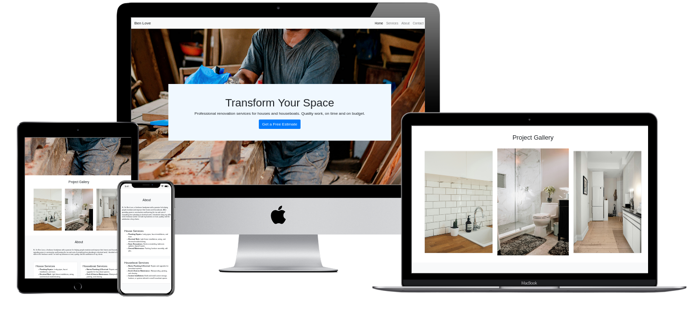

# Ben Love
### Handyman Freelance Website



This is a simple, responsive website for Ben Love, a freelance handyman offering services for both houses and houseboats. The website includes sections for home services, houseboat services, project gallery, about information, and a contact form.

### Live Version

The live version of the website is currently available at: [https://aria-vero-s.github.io/handyman/](https://aria-vero-s.github.io/handyman/). 

The website will soon be hosted at [www.benjaminelove.co.uk](http://www.benjaminelove.co.uk), which will be managed through [www.names.co.uk](https://www.names.co.uk) and served via GitHub Pages.

## Features

- **Navigation Bar**: Links to different sections (Home, Services, About, Contact)
- **Hero Section**: Highlighting Ben's professional renovation services.
- **Project Gallery**: Displays images of completed projects with descriptions.
- **Services Section**: Lists services offered for homes and houseboats.
- **About Section**: Introduces Ben and provides background on his work.
- **Contact Form**: Allows visitors to contact Ben directly through a form.
- **Image Popup**: View project images in a popup with additional descriptions.
Certainly! Here's a more visually structured version of the project with improved indentation for the project files:

## Project Structure

```plaintext
BenLove/
├── index.html           # Main HTML file
├── styles.css           # Custom styles for the website
├── images/              # Folder containing project images
│   ├── image1.jpg       # Project image 1
│   ├── image2.jpg       # Project image 2
│   └── image3.jpg       # Project image 3
└── README.md            # This readme file
```

## Technologies Used

- **HTML5**: For structuring the website content.
- **CSS3**: For styling the website.
- **Bootstrap 4**: For responsive design and layout.
- **JavaScript**: For interactive image popups and functionality.

## Installation

1. Clone the repository to your local machine:  
   `git clone https://github.com/aria-vero-s/BenLove.git`

2. Open the `index.html` file in your browser to view the website.

## Usage

- **Home**: Displays a hero message about Ben's services.
- **Gallery**: A section to showcase completed projects with clickable images. When an image is clicked, a popup shows more details about the project.
- **Services**: Displays a list of services Ben offers for both houses and houseboats.
- **About**: A brief introduction to Ben and his experience in the handyman field.
- **Contact**: A contact form that visitors can use to reach out to Ben.

## Contact Form (with Formspree)

This project includes a contact form that integrates with Formspree to send form submissions directly to your email.

### How to Set Up the Form

1. Make sure to replace the Formspree action URL in the HTML form:
    ```html
    <form id="contact-form" action="https://formspree.io/f/mkxpiz" method="POST">
    ```
    with:
    ```html
    <form id="contact-form" action="https://formspree.io/f/YOUR_FORM_ID" method="POST">
    ```

2. Replace `YOUR_FORM_ID` with your actual Formspree form ID. You can obtain this ID by signing up at [Formspree](https://formspree.io/) and creating a new form.

3. Once the change is made, the form will send submission data to your email.

## Additional Notes

- Make sure each form input has a `name` attribute to ensure data is correctly sent to Formspree.
- The form will submit using the POST method.

Now your contact form will be ready to receive messages and send them to your designated email!

## Customization

- To update the content or services listed, modify the HTML directly, particularly in the **About** and **Services** sections.
- Add more images to the **Gallery** by placing them in the project folder and updating the image paths in the HTML file.

### Notes

- Ensure the images used in the gallery (`image1.jpg`, `image2.jpg`, and `image3.jpg`) are correctly linked in the HTML and located in the same directory as this README file.
- The popup feature allows users to click on images and view descriptions, enhancing the experience of browsing the project gallery.

## License

This project is licensed under the MIT License - see the LICENSE file for details.